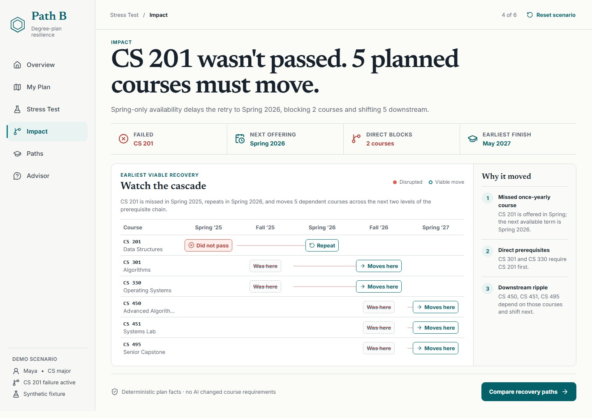

# Path B

Path B is a crash test for a college plan. It shows how one real-life disruption propagates through prerequisites, compares viable recovery paths, and turns the result into one focused advisor conversation.



## Why it is different

Most planning tools answer, “Does this plan work?” Path B asks, “Will it still work when life changes?” The product keeps academic facts deterministic and inspectable while using Claude only to help explain verified tradeoffs in plain language.

The included Maya scenario follows one spring-only course failure through the full resilience loop:

1. Review a plan that is viable but has a vulnerable prerequisite.
2. Run a realistic stress test.
3. Watch the dependency cascade move five planned courses.
4. Choose what matters most: finishing sooner, protecting work hours, or limiting cost.
5. Compare two valid recovery paths and their tradeoffs.
6. Leave with assumptions, next steps, and one useful advisor question.

## Product journey

| Route | Primary job |
| --- | --- |
| `/` | Establish Maya's plan and its vulnerable hinge. |
| `/plan` | Inspect the term-by-term dependency-aware plan. |
| `/stress-test` | Confirm the disruption to model. |
| `/impact` | Trace what moved, when, and why. |
| `/paths` | Set a priority and compare viable recovery paths. |
| `/advisor` | Prepare a concise, evidence-backed advisor brief. |

Protected result routes fail honestly when opened before a scenario is run. The selected priority and path persist through refresh and browser back/forward navigation.

## Trustworthy by design

Course offerings, prerequisites, credit loads, half-time status, cost assumptions, scenario propagation, and graduation timing are computed by the deterministic engine in `src/domain/`. Invalid fixtures and recovery schedules fail closed.

Claude is optional and server-only. The explanation endpoint validates a small request schema, recomputes the scenario on the server, and gives Claude a verified fact packet. Claude may select only allowlisted narrative emphases; server code compiles the final student-facing text. A missing key, timeout, provider failure, or malformed response returns the same complete deterministic experience.

The included Great Lakes University catalog and Maya profile are synthetic demo fixtures. Assumptions and sources are exposed in the Advisor workspace and should be confirmed with a real institution before changing registration.

## Stack

- React 19, TypeScript 6, and Vite 8
- Zod schemas and a deterministic prerequisite/schedule engine
- Anthropic TypeScript SDK behind `/api/explain`
- Vitest and Testing Library for unit/integration coverage
- Playwright and axe-core for routed, responsive, and accessibility checks
- Vercel configuration for the serverless endpoint, SPA rewrites, and defensive headers

## Run locally

Requirements: Node.js 22.12 or newer.

```bash
npm ci
cp .env.example .env
npm run dev
```

PowerShell equivalent for the second command:

```powershell
Copy-Item .env.example .env
```

Open `http://127.0.0.1:5173`. An Anthropic key is not required for the primary demo.

| Environment variable | Required | Purpose |
| --- | --- | --- |
| `ANTHROPIC_API_KEY` | No | Enables Claude-assisted narrative emphasis on the server. |
| `ANTHROPIC_MODEL` | No | Overrides the default `claude-sonnet-5` model. |

Never prefix the key with `VITE_`; that would make it eligible for client exposure.

## Verify

```bash
npm run verify
npm run test:e2e
```

`verify` runs lint, typecheck, unit/integration tests, and a production build. The E2E suite runs the complete journey on desktop and mobile, checks direct-route behavior, browser console health, horizontal overflow, keyboard-accessible navigation, and WCAG A/AA rules.

## Primary demo

Start at `/`, open **Review Maya's plan**, choose **Stress-test this plan**, run the preselected CS 201 disruption, pause on the Impact cascade, compare the recovery paths, select **Faster finish**, and finish on the Advisor question. The flow requires no typing and is designed to fit comfortably inside two minutes.

## Deploy

The repository is ready for a Vercel deployment. Use `npm run build`, keep the output directory as `dist`, and set `ANTHROPIC_API_KEY` only in the deployment's server-side environment if Claude assistance is desired. `vercel.json` provides nested-route rewrites, the `/api/explain` function, and production security headers.

Path B was built for the **Stellic Pathfinders Challenge**, primarily for **Overcoming Obstacles** with **Degree Planning & Discovery** as a secondary category.

The copy-ready 500-word entry, complete tool list, timed recording plan, and final publishing checklist are in [SUBMISSION.md](SUBMISSION.md).
